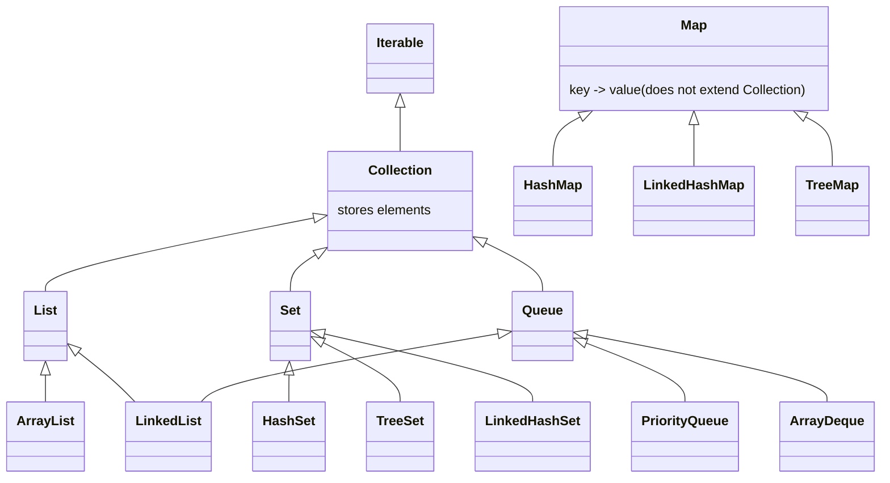

Java provides a set of interfaces and classes to store and manipulate groups of data. There are multiple types of collections, each suited for different use cases.

- **Collection**: The root interface in the collection hierarchy. It represents a group of objects.
- **List**: An ordered collection (also known as a sequence). Lists can contain duplicate elements and allow precise control over where each element is inserted.
- **Set**: A collection that contains no duplicate elements. It models the mathematical set abstraction.
- **Queue**: A collection designed for holding elements prior to processing. Typically orders elements in a FIFO (First-In-First-Out) manner.
- **Map**: An object that maps keys to values. A map cannot contain duplicate keys; each key can map to at most one value.

> [!NOTE]
> `Map` does not extend the `Collection` interface, but it is part of the language.

## Common Implementations

### List
- **`ArrayList`**: Resizable-array implementation. It offers fast random access ($O(1)$) but slower insertions and deletions ($O(n)$) when elements need to be shifted. Use this by default.
- **`LinkedList`**: Doubly-linked list implementation. It offers faster insertions and deletions ($O(1)$) if you have a reference to the node, but slower random access ($O(n)$).

### Set
- **`HashSet`**: Implemented using a hash table. It offers constant time performance ($O(1)$) for basic operations (add, remove, contains), assuming the hash function disperses elements properly. It makes no guarantees as to the iteration order of the set.
- **`TreeSet`**: Implemented using a Red-Black tree. It orders its elements based on their values (natural ordering or a custom `Comparator`). Operations are $O(\log n)$.
- **`LinkedHashSet`**: Hash table and linked list implementation. It maintains the insertion order of elements.

### Map
- **`HashMap`**: Hash table based implementation. Similar to `HashSet`, it offers $O(1)$ performance but no ordering guarantees.
- **`LinkedHashMap`**: Maintains insertion order (or access order) of keys.
- **`TreeMap`**: Red-Black tree based. Keys are sorted.
## Visual Representation

## Performance & Usage

When choosing a collection, consider the performance characteristics (Big O notation) for the operations you will perform most frequently:
- If you need fast lookups by index, use `ArrayList`.
- If you need to ensure uniqueness, use a `Set`.
- If you need key-value association, use a `Map`.
- If you need sorted elements, use `TreeSet` or `TreeMap`.

## Streams vs Collections

It is important to distinguish between Collections and Streams:
- **Collections** are about **storing** and grouping data in memory.
- **Streams** (introduced in Java 8) are about **processing** data. They allow for functional-style operations (map, filter, reduce) on streams of elements. Streams do not store data themselves.
