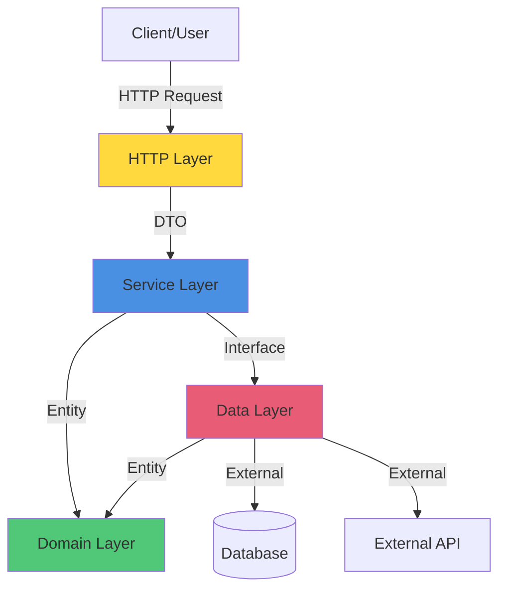
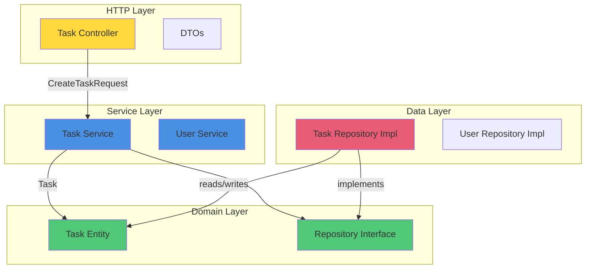

# Kotlin Application Architecture

> [!NOTE]
> This guide shows **Kotlin-specific implementation** of layered architecture with Ktor and Koin. For universal layered architecture concepts (dependency rule, layer responsibilities, DTO vs Entity), see [Layered Architecture](../architecture/layered.md).

## Recap

| Layer | Responsibility | Contains | Dependencies |
|-------|----------------|----------|--------------|
| **Domain** | Business logic and entities | Models, interfaces | None (pure Kotlin) |
| **Data** | Data access and persistence | Repositories, data sources | Domain |
| **Service** | Application business rules | Use cases, orchestration | Domain, Data |
| **HTTP/API** | Request handling and routing | Controllers, DTOs | Service, Domain |

---

## Architectural Overview



---

## Layered Architecture

### The Four Layers

```
┌─────────────────────────────────────┐
│         HTTP/API Layer              │  ← Controllers, Routes, DTOs
│  (Handles requests/responses)       │
├─────────────────────────────────────┤
│         Service Layer               │  ← Business logic orchestration
│  (Use cases, workflows)             │
├─────────────────────────────────────┤
│         Data Layer                  │  ← Repositories, Data sources
│  (Persistence, external APIs)       │
├─────────────────────────────────────┤
│         Domain Layer                │  ← Entities, Value Objects
│  (Core business models)             │
└─────────────────────────────────────┘
```

### Dependency Rule

**Each layer can only depend on layers below it. Never upward.**

```kotlin
// ✅ GOOD: Service depends on Domain
class TaskService(private val repository: TaskRepository) {
    fun createTask(name: String): Task { /* ... */ }
}

// ❌ BAD: Domain depends on Service
data class Task(val service: TaskService) // Domain shouldn't know about services
```

---

## Domain Layer

The **core** of your application. Contains business entities and rules.

### Entities

Pure data models representing business concepts.

```kotlin
// Domain entities
data class Task(
    val id: TaskId,
    val name: String,
    val priority: Priority,
    val status: TaskStatus,
    val createdAt: Instant
)

data class User(
    val id: UserId,
    val email: Email,
    val name: String
)
```

### Value Objects

Immutable objects representing domain concepts with validation.

```kotlin
@JvmInline
value class TaskId(val value: Int) {
    init {
        require(value > 0) { "Task ID must be positive" }
    }
}

@JvmInline
value class Email(val value: String) {
    init {
        require(value.contains("@")) { "Invalid email format" }
    }
}

enum class Priority {
    LOW, MEDIUM, HIGH, URGENT
}

enum class TaskStatus {
    TODO, IN_PROGRESS, DONE, CANCELLED
}
```

### Domain Interfaces

Define contracts without implementation.

```kotlin
interface TaskRepository {
    fun findAll(): List<Task>
    fun findById(id: TaskId): Task?
    fun save(task: Task)
    fun delete(id: TaskId): Boolean
}

interface UserRepository {
    fun findByEmail(email: Email): User?
    fun save(user: User)
}
```

**Key Principles**:
- No framework dependencies
- No database or HTTP concerns
- Pure Kotlin, fully testable
- Contains business rules

---

## Data Layer

Implements data access. Depends on **Domain** interfaces.

### Repository Implementations

```kotlin
class InMemoryTaskRepository : TaskRepository {
    private val tasks = mutableMapOf<TaskId, Task>()

    override fun findAll(): List<Task> = tasks.values.toList()

    override fun findById(id: TaskId): Task? = tasks[id]

    override fun save(task: Task) {
        tasks[task.id] = task
    }

    override fun delete(id: TaskId): Boolean = tasks.remove(id) != null
}
```

```kotlin
class PostgresTaskRepository(
    private val database: Database
) : TaskRepository {

    override fun findAll(): List<Task> {
        return database.query("SELECT * FROM tasks").map { row ->
            Task(
                id = TaskId(row.getInt("id")),
                name = row.getString("name"),
                priority = Priority.valueOf(row.getString("priority")),
                status = TaskStatus.valueOf(row.getString("status")),
                createdAt = Instant.parse(row.getString("created_at"))
            )
        }
    }

    override fun findById(id: TaskId): Task? {
        return database.query("SELECT * FROM tasks WHERE id = ?", id.value)
            .firstOrNull()
            ?.toTask()
    }

    override fun save(task: Task) {
        database.execute(
            """
            INSERT INTO tasks (id, name, priority, status, created_at)
            VALUES (?, ?, ?, ?, ?)
            ON CONFLICT (id) DO UPDATE SET
                name = EXCLUDED.name,
                priority = EXCLUDED.priority,
                status = EXCLUDED.status
            """.trimIndent(),
            task.id.value,
            task.name,
            task.priority.name,
            task.status.name,
            task.createdAt.toString()
        )
    }

    override fun delete(id: TaskId): Boolean {
        val rowsAffected = database.execute("DELETE FROM tasks WHERE id = ?", id.value)
        return rowsAffected > 0
    }
}
```

### External API Clients

```kotlin
interface WeatherService {
    suspend fun getCurrentTemperature(city: String): Temperature?
}

class OpenWeatherMapClient(
    private val httpClient: HttpClient
) : WeatherService {

    override suspend fun getCurrentTemperature(city: String): Temperature? {
        val response = httpClient.get("https://api.openweathermap.org/data/2.5/weather") {
            parameter("q", city)
        }

        return response.body<WeatherResponse>().temp?.let { Temperature(it) }
    }
}
```

**Key Principles**:
- Implements domain interfaces
- Handles persistence details (SQL, HTTP, file I/O)
- Converts between external formats and domain entities

---

## Service Layer

Orchestrates business workflows and use cases. Depends on **Domain** and **Data**.

### Service Implementation

```kotlin
class TaskService(
    private val taskRepository: TaskRepository,
    private val userRepository: UserRepository,
    private val notificationService: NotificationService
) {

    fun createTask(request: CreateTaskRequest): Task {
        // Validate business rules
        require(request.name.isNotBlank()) { "Task name cannot be blank" }

        // Create domain entity
        val task = Task(
            id = TaskId(generateId()),
            name = request.name,
            priority = request.priority,
            status = TaskStatus.TODO,
            createdAt = Clock.System.now()
        )

        // Persist
        taskRepository.save(task)

        // Side effects
        notificationService.send("Task created: ${task.name}")

        return task
    }

    fun assignTask(taskId: TaskId, userId: UserId): Task {
        val task = taskRepository.findById(taskId)
            ?: throw NotFoundException("Task not found")

        val user = userRepository.findById(userId)
            ?: throw NotFoundException("User not found")

        // Business logic: assign task
        val updatedTask = task.copy(assignedTo = user.id)
        taskRepository.save(updatedTask)

        notificationService.send("Task assigned to ${user.name}")

        return updatedTask
    }

    fun completeTask(taskId: TaskId): Task {
        val task = taskRepository.findById(taskId)
            ?: throw NotFoundException("Task not found")

        // Business rule: can't complete cancelled tasks
        require(task.status != TaskStatus.CANCELLED) {
            "Cannot complete a cancelled task"
        }

        val completedTask = task.copy(status = TaskStatus.DONE)
        taskRepository.save(completedTask)

        return completedTask
    }

    fun getTasks(filter: TaskFilter?): List<Task> {
        val tasks = taskRepository.findAll()

        return when (filter?.status) {
            null -> tasks
            else -> tasks.filter { it.status == filter.status }
        }
    }
}
```

### Service Naming Conventions

| Pattern | Example | Purpose |
|---------|---------|---------|
| `create*` | `createTask` | Create new entity |
| `update*` | `updateTask` | Modify existing entity |
| `delete*` | `deleteTask` | Remove entity |
| `get*` | `getTasks`, `getTaskById` | Retrieve entities |
| `find*` | `findTasksByStatus` | Search with criteria |
| `assign*` | `assignTask` | Associate entities |
| `complete*` | `completeTask` | Finish workflow |
| `cancel*` | `cancelTask` | Abort workflow |

**Naming Guidelines**:
- Use verb + noun: `createTask`, not `taskCreate`
- Be specific: `assignTaskToUser`, not `assign`
- Avoid redundant entity name if context is clear: `TaskService.create()` is acceptable

**Key Principles**:
- Contains application business logic
- Orchestrates between repositories
- Handles transactions and workflows
- Manages side effects (notifications, logging)

---

## HTTP/API Layer

Handles HTTP requests/responses. Depends on **Service** and **Domain**.

### DTOs (Data Transfer Objects)

Objects for serializing data over HTTP. Different from domain entities.

```kotlin
@Serializable
data class CreateTaskRequest(
    val name: String,
    val priority: String = "MEDIUM"
)

@Serializable
data class UpdateTaskRequest(
    val name: String?,
    val priority: String?,
    val status: String?
)

@Serializable
data class TaskResponse(
    val id: Int,
    val name: String,
    val priority: String,
    val status: String,
    val createdAt: String
)
```

### Entity ↔ DTO Mapping

```kotlin
// Extension functions for mapping
fun Task.toResponse(): TaskResponse = TaskResponse(
    id = this.id.value,
    name = this.name,
    priority = this.priority.name,
    status = this.status.name,
    createdAt = this.createdAt.toString()
)

fun CreateTaskRequest.toDomain(): CreateTaskInput = CreateTaskInput(
    name = this.name,
    priority = Priority.valueOf(this.priority.uppercase())
)
```

### Controllers/Routes

```kotlin
fun Route.taskRoutes(taskService: TaskService) {

    route("/api/tasks") {

        // GET /api/tasks
        get {
            val status = call.parameters["status"]
            val filter = status?.let { TaskFilter(TaskStatus.valueOf(it)) }

            val tasks = taskService.getTasks(filter)
            val response = tasks.map { it.toResponse() }

            call.respond(HttpStatusCode.OK, response)
        }

        // GET /api/tasks/{id}
        get("/{id}") {
            val id = call.parameters["id"]?.toIntOrNull()?.let { TaskId(it) }
                ?: return@get call.respond(HttpStatusCode.BadRequest, "Invalid ID")

            try {
                val task = taskService.getTaskById(id)
                call.respond(HttpStatusCode.OK, task.toResponse())
            } catch (e: NotFoundException) {
                call.respond(HttpStatusCode.NotFound, e.message ?: "Not found")
            }
        }

        // POST /api/tasks
        post {
            val request = call.receive<CreateTaskRequest>()

            try {
                val task = taskService.createTask(request.toDomain())
                call.respond(HttpStatusCode.Created, task.toResponse())
            } catch (e: IllegalArgumentException) {
                call.respond(HttpStatusCode.BadRequest, e.message ?: "Invalid request")
            }
        }

        // PUT /api/tasks/{id}
        put("/{id}") {
            val id = call.parameters["id"]?.toIntOrNull()?.let { TaskId(it) }
                ?: return@put call.respond(HttpStatusCode.BadRequest)

            val request = call.receive<UpdateTaskRequest>()

            try {
                val task = taskService.updateTask(id, request.toDomain())
                call.respond(HttpStatusCode.OK, task.toResponse())
            } catch (e: NotFoundException) {
                call.respond(HttpStatusCode.NotFound)
            }
        }

        // DELETE /api/tasks/{id}
        delete("/{id}") {
            val id = call.parameters["id"]?.toIntOrNull()?.let { TaskId(it) }
                ?: return@delete call.respond(HttpStatusCode.BadRequest)

            val deleted = taskService.deleteTask(id)

            if (deleted) {
                call.respond(HttpStatusCode.NoContent)
            } else {
                call.respond(HttpStatusCode.NotFound)
            }
        }
    }
}
```

**Key Principles**:
- Thin controllers: delegate to services
- DTOs for serialization, entities for domain
- Handle HTTP concerns only (status codes, content negotiation)
- Validate input, map to domain types

---

## Complete Architecture Example



### Full Example Code

```kotlin
// ============================================
// Domain Layer
// ============================================

data class Task(
    val id: TaskId,
    val name: String,
    val priority: Priority,
    val status: TaskStatus
)

@JvmInline
value class TaskId(val value: Int)

enum class Priority { LOW, MEDIUM, HIGH }
enum class TaskStatus { TODO, DONE }

interface TaskRepository {
    fun findAll(): List<Task>
    fun save(task: Task)
}

// ============================================
// Data Layer
// ============================================

class InMemoryTaskRepository : TaskRepository {
    private val tasks = mutableMapOf<TaskId, Task>()

    override fun findAll(): List<Task> = tasks.values.toList()

    override fun save(task: Task) {
        tasks[task.id] = task
    }
}

// ============================================
// Service Layer
// ============================================

data class CreateTaskInput(val name: String, val priority: Priority)

class TaskService(private val repository: TaskRepository) {
    private var currentId = 1

    fun createTask(input: CreateTaskInput): Task {
        val task = Task(
            id = TaskId(currentId++),
            name = input.name,
            priority = input.priority,
            status = TaskStatus.TODO
        )
        repository.save(task)
        return task
    }

    fun getTasks(): List<Task> = repository.findAll()
}

// ============================================
// HTTP Layer
// ============================================

@Serializable
data class CreateTaskRequest(val name: String, val priority: String)

@Serializable
data class TaskResponse(val id: Int, val name: String, val priority: String)

fun Task.toResponse() = TaskResponse(
    id = id.value,
    name = name,
    priority = priority.name
)

fun Route.taskRoutes(taskService: TaskService) {
    route("/api/tasks") {
        get {
            val tasks = taskService.getTasks()
            call.respond(tasks.map { it.toResponse() })
        }

        post {
            val request = call.receive<CreateTaskRequest>()
            val input = CreateTaskInput(
                name = request.name,
                priority = Priority.valueOf(request.priority)
            )
            val task = taskService.createTask(input)
            call.respond(HttpStatusCode.Created, task.toResponse())
        }
    }
}

// ============================================
// Dependency Injection
// ============================================

val dataModule = module {
    singleOf(::InMemoryTaskRepository) { bind<TaskRepository>() }
}

val serviceModule = module {
    singleOf(::TaskService)
}

fun Application.module() {
    startKoin {
        modules(dataModule, serviceModule)
    }

    install(ContentNegotiation) { json() }

    routing {
        taskRoutes(get())
    }
}
```

---

## Architectural Boundaries

### DTO vs Entity: Key Differences

| Aspect | DTO | Entity |
|--------|-----|--------|
| **Purpose** | Data transfer over HTTP | Business domain model |
| **Location** | HTTP layer | Domain layer |
| **Validation** | Format validation | Business rules |
| **Dependencies** | Serialization libraries | None (pure Kotlin) |
| **Mutability** | Often mutable | Immutable (data classes) |
| **Example** | `CreateTaskRequest` | `Task` |

**Why Separate?**

1. **API Stability**: Change domain without breaking API
2. **Security**: Don't expose internal IDs or sensitive fields
3. **Flexibility**: API can have different structure than domain
4. **Versioning**: Support multiple API versions with same domain

```kotlin
// ❌ BAD: Exposing domain entity directly
@Serializable
data class Task(val id: TaskId, val name: String) // Can't serialize value class easily

// ✅ GOOD: Separate DTO
@Serializable
data class TaskResponse(val id: Int, val name: String)
```

---

## Design Patterns

### Repository Pattern

Abstraction over data access.

```kotlin
interface TaskRepository {
    fun findAll(): List<Task>
    fun findById(id: TaskId): Task?
}

// Swap implementations without changing services
class InMemoryTaskRepository : TaskRepository { /* ... */ }
class PostgresTaskRepository : TaskRepository { /* ... */ }
```

### Dependency Injection Pattern

Inject dependencies via constructors.

```kotlin
class TaskService(
    private val repository: TaskRepository,
    private val notifier: NotificationService
)
```

### Factory Pattern

Create complex objects.

```kotlin
object TaskFactory {
    fun createTask(name: String, priority: Priority): Task {
        return Task(
            id = TaskId(generateId()),
            name = name.trim(),
            priority = priority,
            status = TaskStatus.TODO,
            createdAt = Clock.System.now()
        )
    }
}
```

---

## Testing Strategy by Layer

### Domain Layer

Test pure business logic with no mocks.

```kotlin
@Test
fun `task creation validates name`() {
    assertThrows<IllegalArgumentException> {
        Task(id = TaskId(1), name = "", priority = Priority.HIGH, status = TaskStatus.TODO)
    }
}
```

### Data Layer

Use fakes or test databases.

```kotlin
@Test
fun `repository saves and retrieves task`() {
    val repo = InMemoryTaskRepository()
    val task = Task(TaskId(1), "Test", Priority.LOW, TaskStatus.TODO)

    repo.save(task)

    assertEquals(task, repo.findById(TaskId(1)))
}
```

### Service Layer

Use fakes for repositories, mocks for external boundaries.

```kotlin
@Test
fun `create task saves to repository`() {
    val fakeRepo = FakeTaskRepository()
    val mockNotifier = mockk<NotificationService>(relaxed = true)
    val service = TaskService(fakeRepo, mockNotifier)

    service.createTask(CreateTaskInput("Test", Priority.HIGH))

    assertEquals(1, fakeRepo.findAll().size)
    verify { mockNotifier.send(any()) }
}
```

### HTTP Layer

Use Ktor test utilities.

```kotlin
@Test
fun `POST tasks returns 201`() = testApplication {
    val response = client.post("/api/tasks") {
        contentType(ContentType.Application.Json)
        setBody("""{"name": "Test", "priority": "HIGH"}""")
    }

    assertEquals(HttpStatusCode.Created, response.status)
}
```

---

## Best Practices

### 1. Keep Layers Focused

Each layer has one responsibility. Don't mix concerns.

```kotlin
// ❌ BAD: Service handling HTTP status codes
class TaskService {
    fun createTask(name: String): HttpStatusCode {
        // ...
        return HttpStatusCode.Created
    }
}

// ✅ GOOD: Service returns domain object, controller handles HTTP
class TaskService {
    fun createTask(name: String): Task {
        // ...
        return task
    }
}
```

### 2. Use Interfaces for Abstractions

Define contracts in domain, implement in data layer.

```kotlin
// Domain
interface TaskRepository {
    fun save(task: Task)
}

// Data
class PostgresTaskRepository : TaskRepository {
    override fun save(task: Task) { /* ... */ }
}
```

### 3. Map at Layer Boundaries

Convert between DTOs and entities at the HTTP layer.

```kotlin
// HTTP Layer
post("/tasks") {
    val dto = call.receive<CreateTaskRequest>()
    val input = dto.toDomain() // Map DTO → Domain
    val entity = service.createTask(input)
    val response = entity.toResponse() // Map Domain → DTO
    call.respond(response)
}
```

### 4. Don't Skip Layers

Always go through the service layer, even for simple operations.

```kotlin
// ❌ BAD: Controller calls repository directly
get("/tasks") {
    val tasks = taskRepository.findAll() // Skips service layer
    call.respond(tasks)
}

// ✅ GOOD: Controller calls service
get("/tasks") {
    val tasks = taskService.getTasks()
    call.respond(tasks.map { it.toResponse() })
}
```

---

## References

- [Clean Architecture (Robert C. Martin)](https://blog.cleancoder.com/uncle-bob/2012/08/13/the-clean-architecture.html)
- [Hexagonal Architecture (Alistair Cockburn)](https://alistair.cockburn.us/hexagonal-architecture/)
- [Domain-Driven Design (Eric Evans)](https://www.domainlanguage.com/ddd/)

---

## Next Steps

- Implement with [Ktor](ktor.md) web framework
- Wire up with [Dependency Injection](dependency-injection.md)
- Test with [MockK](mockk.md) and [Testing Strategies](testing.md)
